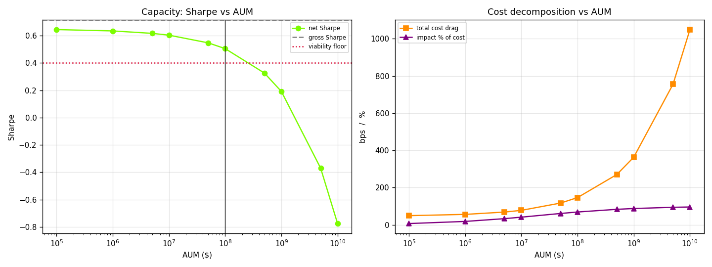
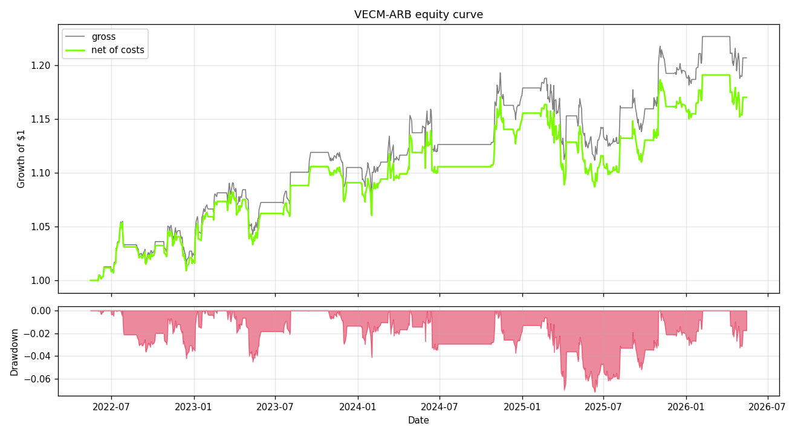

# Statistical-Arbitrage-Trading-System (VECM-ARB)

> A statistical arbitrage engine that identifies cointegration in a *k*-dimensional
> asset space, models the speed of mean reversion (VECM), and executes
> market-neutral strategies with microstructure-aware backtesting (fees,
> borrow, √-impact). It also includes an event-driven “live replay” demo using
> ZeroMQ pub/sub.

**Author:** Aryan Sharma  
**College:** IIT Roorkee

---

## 1) Results at a glance

Backtest on **8 US mega-cap tech names** (AAPL, MSFT, GOOGL, AMZN, NVDA, META,
ADBE, CRM), 5 years of daily data (2021-05 → 2026-05), walk-forward, fully
out-of-sample, net of modelled trading costs at a **$10M** notional.

**Capacity finding:** net Sharpe stays above the 0.4 viability floor up to
≈ **$50M AUM**; beyond that, square-root market impact (growing as √AUM)
erodes the edge — net Sharpe goes negative above ~$2B.




> **An honest econometric note.** In high-dimensional spaces, cointegration
> rarely holds perfectly for long horizons. The engine therefore trades the
> most mean-reverting cointegrating combination (shortest half-life eigenvector),
> gates entries with a half-life filter, and uses a rolling Johansen rank
> inside the breakdown protocol to liquidate/pause when the relationship
> collapses.

---

## 2) System architecture


```
 market-data APIs ─▶ feed microservices ─▶ ZeroMQ / Redis PUB-SUB bus
                                                     │ (topic md.<ASSET>, non-blocking)
                                                     ▼
                              ┌──────────────  MATH ENGINE (asyncio)  ──────────────┐
                              │  Johansen rank · VECM β,α · spread z-score           │
                              └───────┬───────────────────┬─────────────────────────┘
                                      ▼                   ▼
                          Breakdown protocol     Dynamic-risk hedge optimiser
                          (rolling Johansen)      (CVXPY · halts / hard-to-borrow)
                                      └──────────┬────────┘
                                                 ▼
                                  Signal bus (topic sig) ─▶ Portfolio allocator
                                                 ▼
                       Microstructure backtester ─▶ Performance tear sheet
```

**Why ZeroMQ for the reference build?** It is brokerless (runs locally without
external infrastructure) while still demonstrating publish/subscribe semantics.
Transport details are isolated in `Messaging/broker.py`.

---

## 3) Quick start

### 1) Install dependencies
```bash
pip install -r requirements.txt
```

### 2) Download dataset (Yahoo Finance)
Run:
```bash
python Dataset/download_dataset.py --period 5y
```

The loader expects per-asset CSVs in `Dataset/` with:
`Date, Open, High, Low, Close, Volume, Dividends, Stock Splits`

### 3) Run a backtest
```bash
python scripts/run_backtest.py
```

Stress:
```bash
python scripts/run_backtest.py --stress
```

### 4) Run a live replay (ZeroMQ pipeline)
```bash
python scripts/run_live.py --bars 60 --speed 200
```

Stress “NVIDIA halt” feed flag (last 5 bars):
```bash
python scripts/run_live.py --bars 60 --speed 200 --halt-nvidia
```

---

## 4) Econometric decisions

| Decision | Choice | Rationale |
|---|---|---|
| Cointegration test | **Johansen trace** | Generalises Engle-Granger to *k* assets and *r* relations; eigenvectors give β. |
| Price space | **log prices** | Price ratios become additive spreads; β interpretable as elasticities. |
| Deterministic term | constant in the relation (`det_order=0`) | Standard for level series equilibrium modeling. |
| Rank selection | sequential trace test @ 95% | Accepts the largest *r* that is still rejected. |
| Relation traded | **shortest-half-life** eigenvector | Chooses the most tradable mean-reverting relation. |
| β stability | frozen while a position is open | Prevents redefining a spread mid-trade. |
| Signal | rolling z-score (30-bar) | Entry at |z|>2, exit at |z|<0.5, hard-stop at |z|>4 (configurable). |

---

## 5) Dynamic risk & hedging (convex optimisation)

When an asset is **halted** (untradable) or becomes **hard-to-borrow**, the
system reconstructs exposure using the remaining names by solving a convex
optimisation in the hedge allocator (CVXPY).

The backtester uses:
- concentration limits (`MAX_WEIGHT`)
- gross exposure budget (`TARGET_GROSS`)
- borrow-cost awareness via per-name borrow rates

It also includes a **cointegration breakdown protocol** (`Risk/breakdown.py`)
that re-validates the relationship using a rolling Johansen test and debounces
liquidation triggers.

---

## 6) Microstructure cost model

Costs are charged every rebalance (`Backtester/microstructure.py`):

1. **Fees** — maker/taker + commission (bps of traded notional)
2. **Borrow** — short-borrow cost; hard-to-borrow names incur higher rates
3. **√-impact** — capacity driver:
   `impact_fraction = IMPACT_COEF * sigma_daily * sqrt(Q/ADV)`
   with ADV computed from rolling $-volume; impact grows with √AUM.

This is why the capacity curve is meaningful: positions are marked in
**fixed-notional** terms, so impact scales correctly with AUM.

---

## 7) Repository layout

- `config.py` — single source of truth for parameters (universe, windows,
  thresholds, costs/impact, ZeroMQ endpoints)
- `Dataset/` — CSVs + `download_dataset.py` + `loader.py`
- `Econometrics/` — Johansen, VECM, spread construction, and relation selection
- `Backtester/` — walk-forward engine, microstructure costs, tear sheet
- `Risk/` — hedge optimiser + breakdown monitor
- `Messaging/` — ZeroMQ pub/sub pipeline for live replay demo
- `scripts/` — `run_backtest.py`, `run_live.py`
- `Results/` — generated CSVs and plots
- `Models/` — generated model snapshot JSON

---

## 8) Outputs

After running `scripts/run_backtest.py`, the following are typically written:

- `Results/tearsheet.txt`
- `Results/backtest_timeline.csv`
- `Results/capacity_analysis.csv`
- PNG plots such as:
  - `Results/capacity_curve.png`
  - `Results/equity_drawdown.png`
  - `Results/spread_zscore.png`
  - `Results/cost_decomposition.png`
  - `Results/cointegration_rank.png`
- `Models/vecm_arb_model.json`

---

## License
See `LICENSE`.
